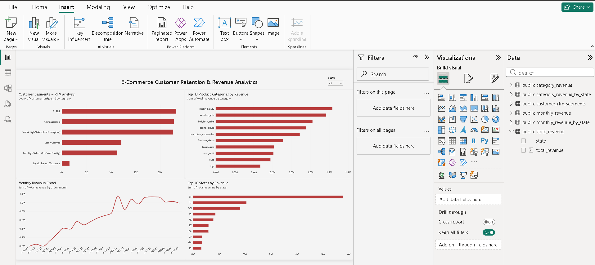
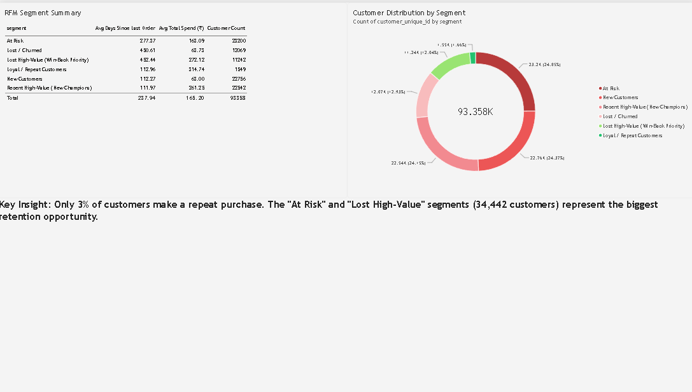

# E-Commerce Customer Retention & CLV Analytics

An end-to-end data analytics project analyzing customer retention patterns and lifetime value using the Olist Brazilian E-Commerce dataset. Built with PostgreSQL, Python, and Power BI.

## Project Overview

This project identifies customer retention challenges in a Brazilian e-commerce marketplace by performing RFM (Recency, Frequency, Monetary) analysis, segmenting customers into actionable groups, and visualizing key business metrics through an interactive dashboard.

**Key finding:** Only ~3% of customers make a repeat purchase, highlighting a significant retention opportunity.

## Dataset

- **Source:** [Olist Brazilian E-Commerce Public Dataset](https://www.kaggle.com/datasets/olistbr/brazilian-ecommerce) (Kaggle)
- 9 relational CSV files covering customers, orders, order items, payments, reviews, products, and sellers (~100k orders, 2016-2018)

## Tech Stack

- **PostgreSQL** (pgAdmin) - data storage, cleaning, and querying
- **Python** (Jupyter/Anaconda) - data extraction, EDA, RFM analysis (pandas, sqlalchemy, psycopg2)
- **Power BI** - interactive dashboard and visualization

## Methodology

1. **Data Import:** Loaded 8 raw Olist CSVs into PostgreSQL, verified row counts and integrity
2. **EDA:** Explored missing values, order status distribution, and data quality
3. **RFM Analysis:** Calculated Recency, Frequency, and Monetary scores at the customer level. Used custom tiered scoring for Frequency (since ~97% of customers had a frequency of 1, standard quartile-based scoring failed)
4. **Customer Segmentation:** Classified customers into 6 segments - At Risk, New Customers, Recent High-Value (New Champions), Lost/Churned, Lost High-Value (Win-Back Priority), Loyal/Repeat Customers
5. **Dashboard:** Built a 2-page interactive Power BI dashboard with cross-filtering by state

## Dashboard

### Page 1 - Business Overview

Customer segment distribution, top product categories by revenue, monthly revenue trend, and top states by revenue - all filterable by state.

### Page 2 - Retention Deep-Dive

Detailed RFM segment summary table and customer distribution breakdown, with key business insights.

## Project Structure

Ecommerce_Retention_Project/
- data/raw/ - Raw Olist CSVs (excluded from repo, see Kaggle link above)
- notebooks/01_data_extraction_eda.ipynb - Data loading, EDA, RFM analysis
- sql/schema_and_queries.sql - Database schema and queries
- powerbi/ecommerce_retention_dashboard.pbix
- screenshots/ - Dashboard screenshots

## Key Insights

- Only ~3% of customers are repeat purchasers - retention is a major growth lever
- "At Risk" and "Lost High-Value" segments together represent 34,442 customers - the biggest win-back opportunity
- SP (Sao Paulo) is the highest-revenue state by a wide margin

## Author

**Rishi Raj**

[LinkedIn](https://www.linkedin.com/in/rishiraj2323/) - [GitHub](https://github.com/rishiraj2323)
